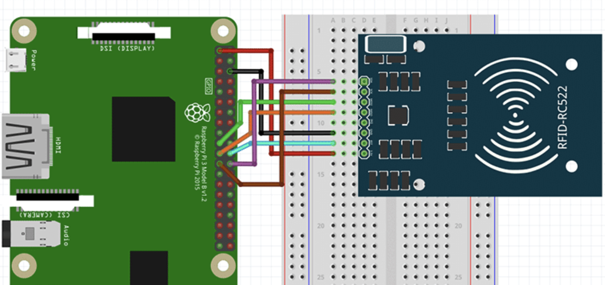
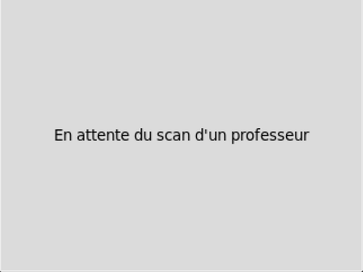
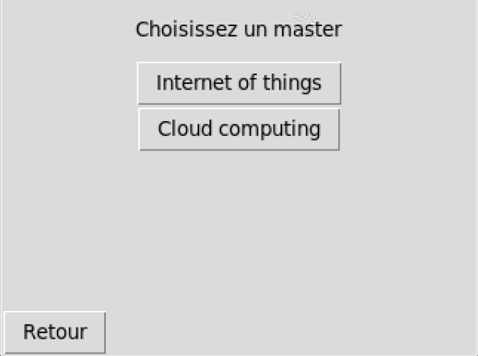
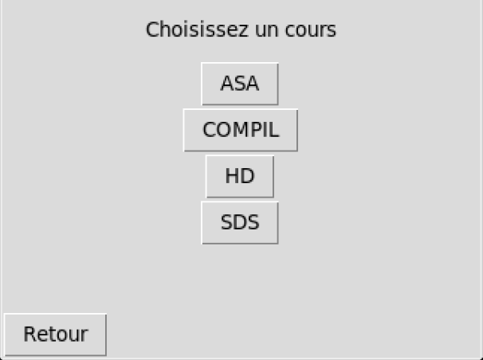
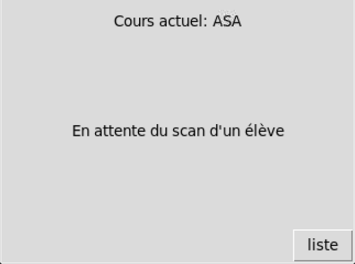
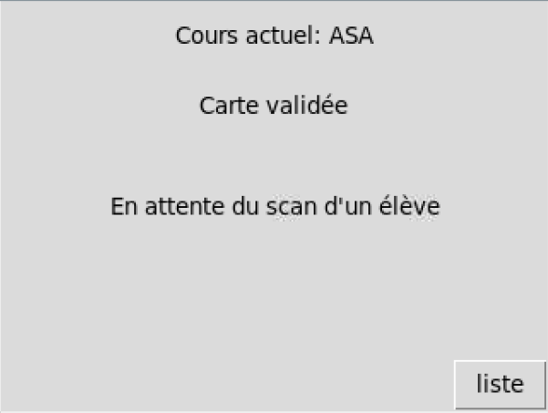
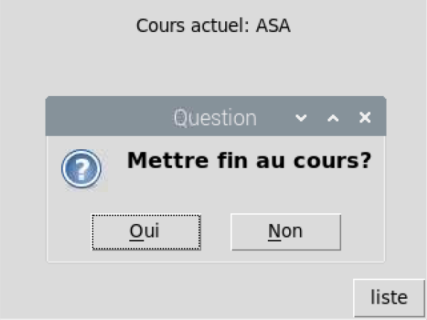

 

## Yoni Gaudiere

# PJI 2023 : Système d'Assistance d'Appel RFID 


 


## Sommaire 

1. [Introduction](#introduction)
2. [Liste d'équipement](#liste-d'équipement)
3. [Préparation du Raspberry Pi](#préparation-du-raspberry-pi)
4. [Accéder au Raspberry Pi via VNC ou SSH](#accéder-au-raspberry-pi-via-vnc-ou-ssh)
    - [Connexion via VNC](#connexion-via-vnc)
    - [Connexion via SSH](#connexion-via-ssh)
5. [Configuration et utilisation du module RFID](#configuration-et-utilisation-du-module-rfid)
    - [Assemblage du RFID RC522](#assemblage-du-rfid-rc522)
    - [Câblage du RFID RC522](#câblage-du-rfid-rc522)
    - [Configuration de Raspbian pour le RFID RC522](#configuration-de-raspbian-pour-le-rfid-rc522)
    - [Préparation de Python pour le RFID RC522](#préparation-de-python-pour-le-rfid-rc522)
6. [Initialisation de la base de données](#initialisation-de-la-base-de-données)
    - [À propos de data.py](#À-propos-de-datapy)
    - [Comment utiliser data.py](#comment-utiliser-datapy)
7. [Utilisation du Système de Suivi des Présences](#utilisation-du-système-de-suivi-des-présences)
    - [Enseignants](#enseignants)
    - [Étudiants](#étudiants)
    - [Fin du Cours](#fin-du-cours)
    - [Enregistrement des données de présence](#enregistrement-des-données-de-présence)
8. [Modification et Personnalisation du Système](#modification-et-personnalisation-du-système)
    - [Ajout d'étudiants, de professeurs et de cours](#ajout-détudiants-de-professeurs-et-de-cours)
    - [Modification de l'interface utilisateur](#modification-de-linterface-utilisateur)
    - [Adaptation à d'autres technologies de carte](#adaptation-à-d'autres-technologies-de-carte)
    - [Utilisation d'une base de données différente](#utilisation-d'une-base-de-données-différente)
    - [Extension du système](#extension-du-système)


## Introduction 

Ce projet a pour but de fournir un système pour faciliter l'administration de la présence des élèves dans les établissements d'enseignement.  
En utilisant la technologie RFID (Radio Frequency IDentification) couplée à une interface utilisateur conviviale sur Raspberry Pi, le système permet d'enregistrer automatiquement la présence des étudiants et de fournir aux enseignants un aperçu en temps réel de l'assiduité.

Les enseignants peuvent choisir le cours qu'ils dispensent via l'interface utilisateur tactile, après quoi les étudiants peuvent enregistrer leur présence en passant simplement leur carte RFID sur le lecteur.   
Les informations sur les cours et les présences sont stockées dans une base de données SQLite pour une récupération et une analyse ultérieures.

Le README suivant détaille les instructions pour la configuration et l'utilisation du système, ainsi que des informations sur la manière dont le code peut être adapté à des besoins spécifiques.

## Liste d'équipement

Vous trouverez ci-dessous tous les éléments que j'ai utilisés pour ce didacticiel Raspberry Pi RFID RC522.

- Raspberry Pi

- Micro SD Card

- RC522 RFID Reader

- Breadboard

- Breadboard Wire

- Fer à souder

## Préparation du Raspberry Pi
Avant de pouvoir utiliser votre Raspberry Pi, vous devez installer un système d'exploitation (OS) sur votre carte microSD. Nous allons utiliser Raspberry Pi OS.

### Étapes

1. Téléchargez et installez un logiciel de gravure de cartes SD : Pour installer l'OS sur votre carte microSD, vous aurez besoin d'un logiciel de gravure de cartes SD. Une option recommandée est "Raspberry Pi Imager", qui est également disponible sur le site web de la Fondation Raspberry Pi.

2. Formatez votre carte microSD : Insérez votre carte microSD dans l'ordinateur. Ouvrez l'outil de gravure de carte SD et sélectionnez "CHOOSE OS", puis choisissez l'image de Raspberry Pi OS. Ensuite, sélectionnez "CHOOSE SD CARD" et sélectionnez votre carte microSD. Cliquez sur "WRITE" pour commencer le processus de gravure.

3. Insérez la carte microSD dans votre Raspberry Pi : Une fois le processus de gravure terminé, éjectez la carte microSD de votre ordinateur et insérez-la dans le slot de carte microSD de votre Raspberry Pi.

4. Mise sous tension de votre Raspberry Pi : Branchez un clavier, une souris et un écran à votre Raspberry Pi, puis connectez le câble d'alimentation. Votre Raspberry Pi devrait démarrer, et vous verrez l'écran de bureau de Raspberry Pi OS.

5. Configuration de Raspberry Pi OS : Lors du premier démarrage, vous serez guidé à travers la configuration de Raspberry Pi OS.

Vous êtes maintenant prêt à utiliser votre Raspberry Pi.

## Accéder au Raspberry Pi via VNC ou SSH
Une fois que votre Raspberry Pi est mis en place et connecté à votre réseau, vous pouvez y accéder à distance via VNC ou SSH. Cela peut être utile si vous souhaitez utiliser votre Raspberry Pi sans avoir à le connecter à un écran ou un clavier. C'est personnellement ce que j'ai fait pour réaliser ce projet.

### Connexion via VNC
VNC (Virtual Network Computing) vous permet de voir et de contrôler le bureau de votre Raspberry Pi à partir d'un autre ordinateur. Pour ce faire, vous devez :

Activer VNC sur votre Raspberry Pi : Ouvrez le menu des préférences Raspberry Pi (clic sur la framboise en haut à gauche), puis sélectionnez "Raspberry Pi Configuration". Sous l'onglet "Interfaces", assurez-vous que VNC est activé.

Installez un client VNC sur votre ordinateur : Vous aurez besoin d'un client VNC pour accéder à votre Raspberry Pi. Un exemple de client VNC que vous pouvez utiliser est RealVNC, qui a des versions pour Windows, Mac et Linux.

Connectez-vous à votre Raspberry Pi : Ouvrez votre client VNC et entrez l'adresse IP de votre Raspberry Pi (vous pouvez trouver cette information dans les paramètres réseau de votre Raspberry Pi). Vous devrez également entrer le nom d'utilisateur et le mot de passe que vous avez définis lors de la configuration de votre Raspberry Pi.

### Connexion via SSH
SSH (Secure Shell) vous permet de passer des commandes à votre Raspberry Pi à partir d'un autre ordinateur. Pour utiliser SSH :

Activer SSH sur votre Raspberry Pi : Ouvrez le menu des préférences Raspberry Pi, puis sélectionnez "Raspberry Pi Configuration". Sous l'onglet "Interfaces", assurez-vous que SSH est activé.

Connectez-vous à votre Raspberry Pi via SSH : Ouvrez un terminal sur votre ordinateur, puis tapez ssh pi@<adresse_IP_de_votre_Raspberry_Pi>. Vous devrez entrer le mot de passe que vous avez défini lors de la configuration de votre Raspberry Pi.

## Configuration et utilisation du module RFID

Pour réaliser ce projet nous avons utiliser un RFID-RC522 de la marque AZ-Delivery.

lien amazon : [https://www.amazon.fr/dp/B01M28JAAZ/ref=twister_B089312YX1?_encoding=UTF8&psc=1](https://www.amazon.fr/dp/B01M28JAAZ/ref=twister_B089312YX1?_encoding=UTF8&psc=1) 

Ce microcontrôleur fournit ses données via le protocole SPI et fonctionne en créant un champ électromagnétique de 13,56 MHz qu'il utilise pour communiquer avec les étiquettes RFID.

Les étapes suivantes décrivent comment effectuer ca configuration.

### 1. Assemblage du RFID RC522

Vous remarquerez que notre lecteur RFID RC522 n'est pas livrés avec les broches d'en-tête déjà soudées. 
Il faudra donc, à l'aide d'un fer à souder chaud et d'un peu de soudure, soudre chacune des broches.

Avec les broches d'en-tête maintenant soudées à votre circuit RFID, il est maintenant prêt à l'emploi.

### 2. Cablage du RFID RC522

Sur le RFID RC522, vous remarquerez qu'il y a 8 connexions possibles, à savoir SDA (Serial Data Signal), SCK (Serial Clock), MOSI (Master Out Slave In), MISO (Master In Slave Out), IRQ (Interrupt Request), GND (Ground Power), RST (Reset-Circuit) et 3.3v (3.3v Power In).   
Nous aurons besoin de câbler tout cela sauf l' IRQ aux broches GPIO de notre Raspberry Pi.  

Vous pouvez soit les câbler directement aux broches GPIO, soit comme je les fait, brancher le RFID RC522 dans un Breadboard, puis câbler à partir de là aux broches GPIO de notre Raspberry Pi.  


Suivez les instruction de branchement suivant :

- SDA se connecte à la broche 24 .
- SCK se connecte à la broche 23 .
- MOSI se connecte à la broche 19 .
- MISO se connecte à la broche 21 .
- GND se connecte à la broche 6 .
- RST se connecte à la broche 22 .
- 3.3v se connecte à la broche 1 .

   
     

### 3. Configuration de Raspbian pour le RFID RC522

Avant de commencer a utilisé le RFID RC522 sur notre Raspberry Pi, nous devrons d'abord apporter des modifications à sa configuration.  
Par défaut, le Raspberry Pi a le SPI (Serial Peripheral Interface) désactivé, ce qui est un peu problématique car c'est ce que traverse notre circuit de lecteur RFID.  

Il faut donc réactiver cette interface, suivez simplement les étapes ci-dessous pour configurer le Raspberry Pi pour utiliser l'interface SPI.  

1. Commencer par ouvrir d'abord l' outil raspi-config.  
Pour le faire, ouvrer le terminal et exécuter la commande suivante.  

```
sudo raspi-config
```

2. Sélectionner " options d'interfaçage ". Une fois cette option sélectionnée, appuyez sur Entrée.  

3. Maintenant, sur cet écran suivant, sélectionner " P4 SPI ". Il vous sera alors demandé si vous souhaitez activer l'interface SPI, sélectionnez Oui.  

4. Avant que l'interface SPI ne soit entièrement activée, nous devrons d'abord redémarrer le Raspberry Pi. Pour ce faire, revenez d'abord au terminal et tapez la commande suivante : 

```
sudo reboot
```

### 4. Préparer Python pour le RFID RC522

1. Avant de commencer la programmation, nous devons d'abord mettre à jour notre Raspberry Pi pour nous assurer qu'il exécute la dernière version de tous les logiciels. Exécutez les deux commandes suivantes sur votre Raspberry Pi pour le mettre à jour.

```
sudo apt update
sudo apt upgrade
```  

2. Maintenant, la dernière chose dont nous avons besoin avant de pouvoir continuer est d'installer les packages python3-dev , python-pip et  git . Exécutez simplement la commande suivante sur votre Raspberry Pi pour installer tous les packages requis pour ce guide de configuration de votre lecteur RFID.

```
sudo apt install python3-dev python3-pip
```  

3. Pour commencer, nous devons d'abord installer la Python Library spidev sur notre Raspberry Pi.  
La bibliothèque spidev aide à gérer les interactions avec le SPI.   
Nous en avons besoin pour que le Raspberry Pi interagisse avec le RFID RC522.  
Exécutez la commande suivante sur votre Raspberry Pi pour installer spidev sur votre Raspberry Pi via pip.  

```
sudo pip3 install spidev
```

4. Maintenant que nous avons installé la bibliothèque spidev sur notre Raspberry Pi, nous pouvons maintenant procéder à l'installation de la bibliothèque MFRC522.  
Cette bibliothèque est nécessaire pour interagir avec le module RFID. Vous pouvez l'installer avec la commande suivante.  


```
sudo pip3 install mfrc522
```

5. Avec la bibliothèque maintenant enregistrée sur notre Raspberry Pi, nous pouvons commencer à utiliser le RFID.  
Vous pouvez tester le module RFID en lançant le script Python test.py inclus dans ce projet.   
Ce script lit les informations d'une carte RFID lorsqu'elle est scannée et les affiche à l'écran.   

## Initialisation de la base de données

Ce projet utilise SQLite pour gérer une base de données locale.  
Avant de commencer à utiliser le système de suivi des présences, il est nécessaire de créer et d'initialiser la base de données.  
Cela est fait grâce au fichier data.py.


### À propos de data.py

Le script data.py est responsable de la création et de l'initialisation de la base de données du système de suivi des présences.   
Il crée plusieurs tables :

- Students : Stocke les informations sur les étudiants, y compris leur nom, prénom, et l'identifiant de leur carte RFID.
- Teachers : Similaire à la table Students, mais pour les enseignants.
- Module : Contient les noms des différents modules ou matières, ainsi que le master associé.
- Courses : Enregistre les cours, y compris les détails tels que le module associé, la date du cours, l'heure de début, l'heure de fin, etc.
- Attendance : Tient à jour la présence des étudiants pour chaque cours.  


### Comment utiliser data.py

Pour créer et initialiser la base de données, suivez ces étapes :

1. Ouvrez un terminal dans le répertoire contenant le fichier data.py.  
2. Exécutez la commande suivante : 
```
python3 data.py
```

Le script créera automatiquement la base de données si elle n'existe pas encore et initialisera les tables avec des données d'échantillon.  

Parmi ces données d'échantillon, vous trouverez un étudiant, "Yoni Gaudiere", et un professeur, "Giuseppe Lipari".    
Les identifiants de leurs cartes RFID respectives sont ceux fournis avec le kit AZ-Delivery RFID.   
La carte représente l'élève et le badge le professeur. Nous les utiliserons pour tester le système.  

Pour connaitre l'identifiant de votre carte et badge fourni avec le RFID RC522 vous lancer le script Python test.py inclus dans ce projet.   
Ce script lit les informations d'une carte ou badge RFID lorsqu'il est scannée et les affiche.

Il suffit d'ouvrir un terminal dans le répertoire contenant le fichier test.py et d'excécuter la commande suivante :  
```
python3 test.py
```
scannez ensuite la carte ou le badge pour connaitre sont code ID.  

Attention :  
Assurez-vous que le fichier data.py a été exécuté avec succès avant d'essayer d'utiliser le système de suivi des présences.    
Si le script ne s'exécute pas correctement, le système ne sera pas en mesure d'accéder aux données nécessaires pour fonctionner.  


 


## Utilisation du Système de Suivi des Présences

Vous pouvez maintenant lancer le système de suivie de présences.  

1. Ouvrez un terminal dans le répertoire contenant le fichier main.py.  
2. Exécutez la commande suivante : 
```
python3 main.py
```

Ce système de suivi des présences est conçu pour être intuitif et facile à utiliser pour les enseignants et les élèves. Voici les étapes pour utiliser le système.

### Enseignants

1. Au démarrage, le système est en attente du scan du badge d'un professeur. 

<p align="center">
 

2. Lorsque le lecteur RFID lit le badge de l'enseignant, le système vérifie l'identifiant RFID du badge dans la base de données pour s'assurer qu'il correspond bien a un enseignant. Si cela est bien le cas l'écran affichera une interface utilisateur qui permet à l'enseignant de sélectionner le master qu'il souhaite.

<p align="center">
 

3. Une liste des cours disponibles sera alors affichée. L'enseignant peut sélectionner le cours qu'il souhaite dispenser. 

<p align="center">
 

### Etudiants

1. Une fois le cours démarré par l'enseignant, les étudiants peuvent enregistrer leur présence.

<p align="center">


2. Pour enregistrer sa présence, un étudiant doit simplement passer sa carte RFID sur le lecteur.
Le système vérifie l'identifiant RFID de la carte de l'étudiant dans la base de données et enregistre sa présence pour le cours en cours.

<p align="center">


3. Quand un cours est démarré, Il est possible à tout moment voir la liste des élèves présents en appuyant sur le bouton 'liste'. Cette liste est mise à jour en temps réel à chaque fois qu'un élève enregistre sa présence.

<p align="center">


### Fin du Cours

1. À la fin du cours, l'enseignant doit à nouveau scanner son badge RFID pour terminer le cours.

<p align="center">


2. Une fois le cours terminé, le système n'acceptera plus les présences pour ce cours spécifique. Toute tentative d'enregistrement après la fin du cours sera ignorée.

### Enregistrement des données de présence
Toutes les données de présence sont enregistrées dans la base de données SQLite.  
Cela permet aux enseignants de récupérer et d'analyser les données de présence à tout moment en interogant la base de donnée.

J'ai créé un fichier fiche.py qui permet, avec le code ID de la carte d'un étudiant, de lister tous les cours auxquels il a participé tout au long de l'année ainsi que leur date.  
Il suffit de se placer dans le répertoire contenant le fichier fiche.py et de lancer la commande suivante.  

```
python3 fiche.py
```

## Modification et Personnalisation du Système
Le système de suivi des présences a été conçu pour être flexible et modulaire, permettant ainsi des personnalisations et des modifications en fonction des besoins spécifiques de chaque établissement d'enseignement.  
Voici quelques façons possible pour modifier et personnaliser le système.

### Ajout d'étudiants, de professeurs et de cours
Il est possible d'ajouter de nouveaux étudiants, professeurs et cours en ajoutant simplement des entrées dans les tables correspondantes de la base de données SQLite.   
Chaque entrée dans la table "Students" ou "Teachers" doit avoir un identifiant RFID unique.

### Modification de l'interface utilisateur
L'interface utilisateur est basée sur Python et utilise la bibliothèque Tkinter pour créer les éléments d'interface utilisateur.  
Il est possible de modifier le code Python pour changer l'apparence de l'interface utilisateur, ajouter de nouvelles fonctionnalités, ou changer la façon dont les utilisateurs interagissent avec le système.

### Adaptation à d'autres technologies de carte
Bien que le système ait été conçu pour utiliser la technologie RFID, vous pouvez adapter le code pour utiliser d'autres technologies de carte, comme les cartes à puce ou les cartes magnétiques.  
Il est possible d'utiliser une carte moins puissante qu'un raspberry pie 4 comme par exemple un raspberry pico.  
Il faudra probablement changer la façon dont le système lit les identifiants des cartes et interagit avec le lecteur de cartes.  

### Utilisation d'une base de données différente
Le système utilise SQLite pour la gestion des données car c'est une solution de base de données légère et autonome qui ne nécessite pas de serveur séparé.   
Cependant, Il est possible d'adapter le code pour utiliser une base de données différente, comme MySQL ou PostgreSQL, si besoin de plus de fonctionnalités ou pour intégrer le système de suivi des présences à une base de données existante.  

### Extension du système
Le système de suivi des présences est modulaire, on pourrai ajouter de nouvelles fonctionnalités ou modules comme par exemple, une fonctionnalité qui envoie automatiquement un email aux étudiants absents, ou qui génère des rapports de présence pour chaque cours.  

On pourrait créer un site web dans lequel un enseignant puisse si connecter pour consulter les fiches de présence automatiquement génerée.


